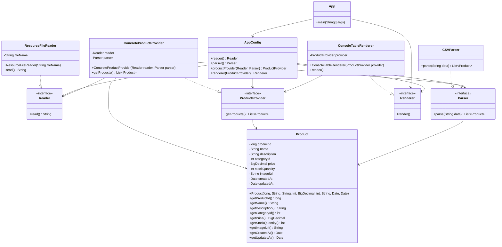

# Лабораторная работа №2
# Конфигурирование приложение Spring c помощью аннотаций. Применение AOП для логирования

## Ход работы
В этой работе мы перешли на новое, более простое конфигурирование приложения с помощью аннотаций, добавили функционал по представлению таблиц в виде HTML и измерили скорость выполнения нашего кода c помощью инструментов АОП.
1) Результат выполнения лабораторной работы №1 был скопирован в директорию /les04/lab.
2) Приложение было переделано таким образом, чтобы его конфигурирование осуществлялось с помощью аннотаций @Component.
3) С использованием аннотации @Value и выражения SpEL было реализовано получение имени файла для загрузки продуктов из конфигурационного файла application.properties. 
Данный файл был помещён в каталог ресурсов src/main/resources.
4) Была добавлена ещё одна реализация интерфейса Renderer — HTMLTableRenderer, которая выводила таблицу с товарами в HTML-файл. 
Приложение было настроено таким образом, чтобы при его работе вызывалась реализация HTMLTableRenderer, а не ConsoleTableRenderer.
5) С помощью событий жизненного цикла бина в консоль были выведены дата и время полной инициализации бина ResourceFileReader.
6) С помощью инструментов AOP было измерено время, затрачиваемое на парсинг CSV-файла.

## Вывод
Было изучено конфигурирование приложение Spring c помощью аннотаций, применено AOП для логирования

