# Лабораторная работа №3
# Технологии работы с базами данных.JDBC

## Ход работы
В этой работе нам приложение научилось сохранять данные в базе данных. 
А также оно может выполнять SQL запросы и выводить их результаты в логи. 
В этом помог механизм JDBC (Java Database Connectivity), 
и такие инструменты Spring как DataSource, JDBCTemplate, 
RowMapper упрощающие работу с JDBC.

1) К приложению была подключена встраиваемая база данных H2 с использованием EmbeddedDatabaseBuilder.
Был написан SQL-скрипт, создающий две таблицы: PRODUCTS для хранения информации о продуктах и CATEGORIES для хранения информации о категориях. 
В таблице PRODUCTS был добавлен внешний ключ category_id, который ссылается на таблицу CATEGORIES.

2) EmbeddedDatabaseBuilder был настроен таким образом, чтобы при старте приложения выполнялся SQL-скрипт schema.sql, создающий в базе данных таблицы CATEGORIES и PRODUCTS.

3) Для таблицы CATEGORIES был создан Java-класс Category, предназначенный для моделирования сущности «Категория». 
Также был создан класс ConcreteCategoryProvider, аналогичный классу ConcreteProductProvider. 
Данный класс предоставлял данные о категориях из CSV-файла category.csv, расположенного в директории src/main/resources приложения.

4) Была добавлена новая реализация интерфейса Renderer — DatabaseRenderer. 
Данная реализация сохраняла данные, считанные из CSV-файлов, в таблицы базы данных. 
Реализация DatabaseRenderer была настроена как используемая по умолчанию.

5) Был реализован класс CategoryRequest. 
Данный класс выполнял SQL-запрос к базе данных для получения списка категорий, количество товаров в которых больше единицы. 
Полученная информация выводилась в консоль с помощью библиотеки logback на уровне INFO.

```mermaid
classDiagram
    class App {
        +main(String[] args)
    }

    class AppConfig {
        +dataSource() DataSource
        +jdbcTemplate(DataSource) JdbcTemplate
    }

    class Renderer {
        <<interface>>
        +render()
    }

    class DatabaseRenderer {
        -JdbcTemplate jdbcTemplate
        -ProductProvider productProvider
        -CategoryProvider categoryProvider
        -CategoryRequest categoryRequest
        +DatabaseRenderer(DataSource, ProductProvider, CategoryProvider, CategoryRequest)
        +render()
    }

    class HTMLTableRenderer {
        -ProductProvider productProvider
        +render()
    }

    class ConsoleTableRenderer {
        -ProductProvider provider
        +ConsoleTableRenderer(ProductProvider)
        +render()
    }

    class ProductProvider {
        <<interface>>
        +getProducts() List~Product~
    }

    class ConcreteProductProvider {
        -Reader reader
        -Parser parser
        +getProducts() List~Product~
    }

    class CategoryProvider {
        <<interface>>
        +getCategories() List~Category~
    }

    class ConcreteCategoryProvider {
        +getCategories() List~Category~
    }

    class Reader {
        <<interface>>
        +read() String
    }

    class ResourceFileReader {
        -String filePath
        +ResourceFileReader()
        +read() String
    }

    class Parser {
        <<interface>>
        +parse(String data) List~Product~
    }

    class CSVParser {
        +parse(String data) List~Product~
    }

    class Product {
        -long productId
        -String name
        -String description
        -int categoryId
        -BigDecimal price
        -int stockQuantity
        -String imageUrl
        -Date createdAt
        -Date updatedAt
        +Product(long, String, String, int, BigDecimal, int, String, Date, Date)
        +getProductId() long
        +getName() String
        +getDescription() String
        +getCategoryId() int
        +getPrice() BigDecimal
        +getStockQuantity() int
        +getImageUrl() String
        +getCreatedAt() Date
        +getUpdatedAt() Date
    }

    class Category {
        -int categoryId
        -String name
        -String description
        +Category(int, String, String)
        +getCategoryId() int
        +getName() String
        +getDescription() String
    }

    class CategoryRequest {
        -JdbcTemplate jdbcTemplate
        +CategoryRequest(JdbcTemplate)
        +printCategoriesWithMoreThanOneProduct()
    }

    class DataSource
    class JdbcTemplate

    App --> AppConfig
    App --> Renderer

    AppConfig --> DataSource
    AppConfig --> JdbcTemplate

    DatabaseRenderer ..|> Renderer
    HTMLTableRenderer ..|> Renderer
    ConsoleTableRenderer ..|> Renderer

    ConcreteProductProvider ..|> ProductProvider
    ConcreteCategoryProvider ..|> CategoryProvider
    ResourceFileReader ..|> Reader
    CSVParser ..|> Parser

    DatabaseRenderer --> ProductProvider
    DatabaseRenderer --> CategoryProvider
    DatabaseRenderer --> CategoryRequest
    DatabaseRenderer --> JdbcTemplate
    DatabaseRenderer --> DataSource

    HTMLTableRenderer --> ProductProvider
    ConsoleTableRenderer --> ProductProvider

    ConcreteProductProvider --> Reader
    ConcreteProductProvider --> Parser
    ConcreteProductProvider --> Product

    ConcreteCategoryProvider --> Category

    ResourceFileReader --> Reader

    Parser --> Product
    ProductProvider --> Product
    CategoryProvider --> Category

    CategoryRequest --> JdbcTemplate
```

## Вывод
Были изучены технологии работы с базами данных.

