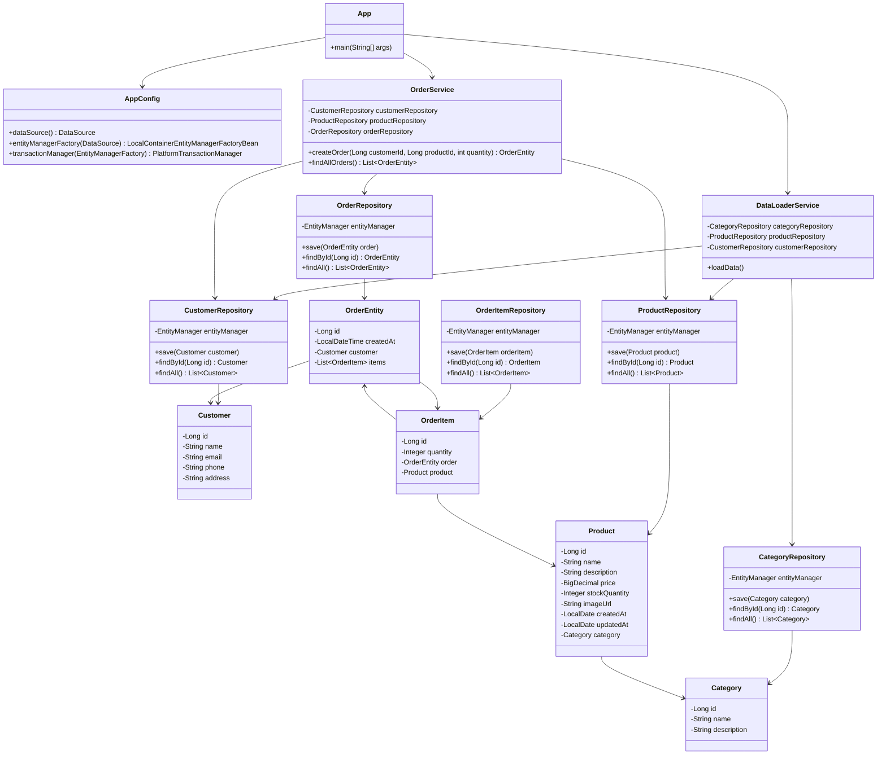

# Лабораторная работа №4
# Технологии работы с базами данных. JPA. Spring Data

## Ход работы
В данной лабораторной работе был выполнен переход с использования Spring JDBC на использование ORM Hibernate. 
Приложение было расширено новыми сущностями, а его структура была приведена в соответствие со слоистой архитектурой.
В приложении был создан DataSource, соответствующий требованиям лабораторной работы. 
В качестве базы данных была использована H2. 
Для реализации DataSource была подключена библиотека HikariCP, а именно класс HikariDataSource.
Для работы с базой данных была подключена библиотека Hibernate, использующая технологию ORM. 
Схема базы данных создавалась автоматически на основании JPA-сущностей.

1) В пакете ru.bsuedu.cad.lab.entity были созданы JPA-сущности, описывающие структуру базы данных. 
Для сущностей были использованы аннотации JPA, такие как @Entity, @Table, @Id, @ManyToOne, @OneToMany и @JoinColumn.

2) В пакете ru.bsuedu.cad.lab.repository были реализованы репозитории для каждой сущности. 
Репозитории содержали методы для создания записи, получения записи по идентификатору и получения всех записей.

3) В пакете ru.bsuedu.cad.lab.service были созданы сервисы для создания заказа и получения списка всех заказов. 
Создание заказа выполнялось в рамках транзакции с использованием аннотации @Transactional.

5) В пакете ru.bsuedu.cad.lab.app был реализован клиент для сервиса создания заказа. 
6) При запуске приложения выполнялась загрузка данных из CSV-файлов category.csv, customer.csv и product.csv, после чего создавался новый заказ.

Информация о создании заказа была выведена в лог. 
Для подтверждения сохранения заказа в базе данных было выполнено получение списка всех заказов. 
В результате в консоль была выведена информация о созданном заказе и количестве заказов в базе данных.

## Вывод
Были изучены технологии работы с базами данных, JPA и Spring Data.

