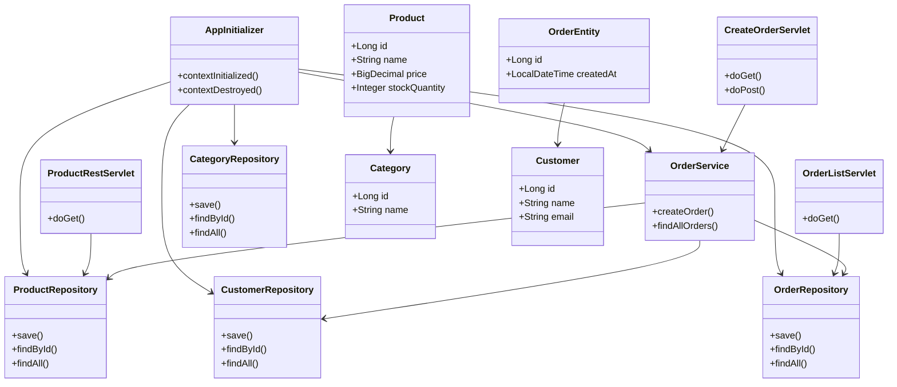

# Лабораторная работа №4
# Разработка и развертывание Web-приложений

## Ход работы
В данной лабораторной работе консольное приложение из лабораторной работы №4 было преобразовано в веб-приложение с графическим интерфейсом.
Был установлен и настроен сервер Apache Tomcat 11. 
В конфигурационный файл добавлен пользователь с правами администратора для управления приложениями.
Проект был переконфигурирован для сборки WAR-файла вместо JAR. 
В зависимости добавлены Jakarta Servlet API и библиотека Gson для работы с JSON.
Разработан инициализатор приложения, который создает EntityManagerFactory, репозитории и сервисы при запуске веб-приложения, сохраняя их в контекст сервлета для доступа из всех сервлетов.
Реализован сервлет для отображения списка заказов, доступный по адресу /orders. 
Сервлет формирует HTML-страницу с таблицей заказов и кнопкой перехода к форме создания заказа.
Реализован сервлет для создания заказа, доступный по адресу /create-order. 
Сервлет отображает форму с выпадающими списками клиентов и товаров, а после отправки формы сохраняет заказ в базу данных и перенаправляет пользователя на страницу со списком заказов.
Реализован REST сервис для получения информации о продуктах, доступный по адресу /api/products. 
Сервлет возвращает JSON-массив, содержащий для каждого продукта название, название категории и количество на складе.
Создан сервлет для загрузки тестовых данных из CSV-файлов, доступный по адресу /load-data.
Сборка приложения выполнена командой gradle war. 
Полученный WAR-файл развернут на сервере Apache Tomcat 11.
REST сервис протестирован с помощью Postman. GET-запрос к /api/products возвращает корректный JSON-ответ.

## Вывод
В ходе лабораторной работы изучены технологии разработки и развертывания веб-приложений на Java. 
Получены практические навыки настройки сервера Tomcat, создания сервлетов, разработки REST API, сборки WAR-файлов и тестирования веб-сервисов. 
Создано веб-приложение "Магазин зоотоваров" с функционалом просмотра и создания заказов.

