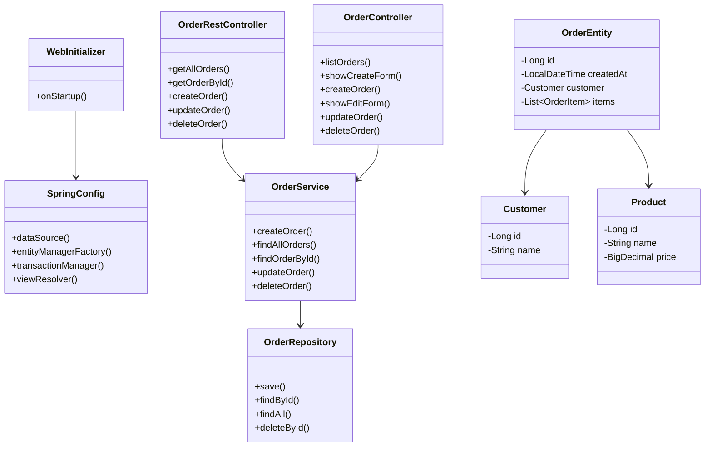

# Лабораторная работа №6
# Разработка Web-приложений с использованием технологии Spring MVC

## Ход работы
В ходе выполнения лабораторной работы веб-приложение из лабораторной работы №5 было переработано с использованием фреймворка Spring MVC. Проект был настроен для работы со Spring MVC путем добавления соответствующих зависимостей в build.gradle, включая Spring Web MVC, Spring ORM, Thymeleaf и Thymeleaf Spring. Был реализован REST API для работы с заказами с использованием аннотации @RestController, который предоставляет endpoints для получения списка заказов, получения заказа по идентификатору, создания заказа, удаления заказа и изменения заказа. Для визуального отображения данных был подключен шаблонизатор Thymeleaf с настроенным ViewResolver для обработки HTML-шаблонов из директории /WEB-INF/templates/. Реализован Web-интерфейс для работы с заказами с помощью отдельного контроллера, который позволяет получать список заказов, создавать новые заказы через форму, удалять заказы и редактировать существующие заказы. Сборка приложения выполнена командой gradle war, после чего WAR-файл был развернут на сервере Apache Tomcat 11. REST сервис протестирован с помощью Postman, для чего была создана коллекция запросов, включающая GET, POST, PUT и DELETE запросы к API. Web-интерфейс также был протестирован в браузере.

## Вывод
В результате выполнения лабораторной работы изучены технологии разработки веб-приложений с использованием Spring MVC. Получены практические навыки настройки Spring MVC приложения, создания REST API с использованием @RestController, интеграции шаблонизатора Thymeleaf, реализации CRUD операций для Web-интерфейса и тестирования API с помощью Postman. Создано полноценное Spring MVC приложение "Магазин зоотоваров", предоставляющее как REST API для программного взаимодействия, так и Web-интерфейс для пользователей с возможностью создания, просмотра, редактирования и удаления заказов.

